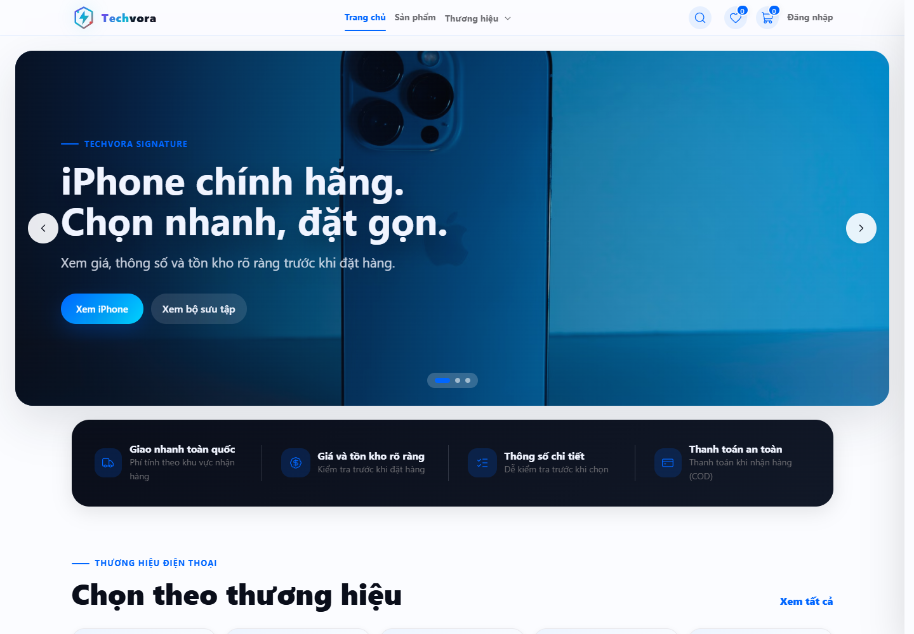

# Techvora — Cửa hàng điện thoại ASP.NET Core

Website bán điện thoại được xây dựng bằng **ASP.NET Core 8 MVC, EF Core, SQL Server và ASP.NET Core Identity**. Giao diện tiếng Việt, hỗ trợ desktop và mobile.



Ảnh demo khác: [trang quản trị](docs/design/screenshots/admin.png). [Chạy demo local](#demo-local) · [xem bằng chứng kiểm thử](docs/user-guide/backend-tests.md). Repo chưa có video hoặc URL triển khai công khai.

## Chức năng nổi bật

| Luồng | Chức năng |
| --- | --- |
| Mua sắm | Tìm kiếm, lọc/sắp xếp, phân trang, so sánh giá/thông số, wishlist và giỏ hàng |
| Đặt hàng | Checkout theo địa chỉ, voucher, COD/VNPAY, hủy đơn và mua lại |
| Hậu mãi | Theo dõi giao hàng, thông báo, review kèm ảnh và yêu cầu đổi trả/bảo hành |
| Quản trị | Dashboard, catalog, tồn kho, đơn hàng, hoàn tiền, hóa đơn/CSV, GHN và duyệt review |

Bản chạy mặc định hiển thị phạm vi **Sprint 2**; các route thuộc Sprint 3 trở lên vẫn bị chặn.

## Công nghệ

- ASP.NET Core 8 MVC và Razor Views
- Entity Framework Core 8, SQL Server và ASP.NET Core Identity
- HTML, CSS và JavaScript; asset dùng để chạy đã có sẵn trong `src/backend/wwwroot`
- SMTP tùy chọn cho luồng đặt lại mật khẩu

## Demo local

Yêu cầu: **.NET SDK 8+** và **SQL Server** có quyền tạo database. Không cần cài Node.js hoặc Docker để chạy ứng dụng.

```powershell
git clone https://github.com/Anhtuan2005/E-Lectrical--Commerce-.git
cd E-Lectrical--Commerce-
dotnet restore EcommerceApp.sln
dotnet tool restore

# Có thể thay localhost bằng SQL Server instance trên máy của bạn.
dotnet user-secrets set "ConnectionStrings:DefaultConnection" "Server=localhost;Database=TechvoraDemo;Trusted_Connection=True;TrustServerCertificate=True;Encrypt=False" --project src/backend/EcommerceApp.csproj
dotnet tool run dotnet-ef database update --project src/backend/EcommerceApp.csproj --startup-project src/backend/EcommerceApp.csproj

# Bật dữ liệu minh họa trên database demo riêng.
$env:Demo__Enabled = "true"
$env:Email__Enabled = "false"
dotnet run --project src/backend/EcommerceApp.csproj --launch-profile http
```

Mở [http://localhost:5009](http://localhost:5009).

| Tài khoản demo | Mật khẩu | Quyền |
| --- | --- | --- |
| `admin@shop.vn` | `Admin@123` | Admin |
| `khachhang1@shop.vn` | `User@123` | Khách hàng |

`Demo:Enabled` mặc định là `false` và không được phép bật trong môi trường Production. Khi dùng xong, xóa biến demo bằng `Remove-Item Env:Demo__Enabled`.

Để xem luồng chính: so sánh hai điện thoại cùng danh mục, đăng nhập tài khoản khách, áp dụng voucher và đặt hàng COD/VNPAY; sau đó mở lịch sử để hủy/mua lại, theo dõi giao hàng, review hoặc gửi yêu cầu hỗ trợ. Đăng nhập admin để xem dashboard, xử lý đơn, tồn kho, GHN, hóa đơn, CSV và duyệt review. VNPAY/GHN cần thông tin sandbox thật để gọi dịch vụ ngoài; các tình huống callback lặp và tranh chấp tồn kho được kiểm tra bằng integration test.

## Cấu trúc chính

```text
README.md                        Giới thiệu và cách chạy dự án
docs/requirements/               Tài liệu yêu cầu
docs/design/                     Thiết kế và ảnh minh chứng
docs/user-guide/                 Hướng dẫn và kết quả kiểm thử
src/frontend/                   Nguồn CSS/JavaScript và công cụ build giao diện
src/backend/                    Ứng dụng ASP.NET Core, Razor Views và wwwroot
database/schema/                EF Core migrations
database/seed/                  Dữ liệu demo
test/test-cases/                Unit, integration và browser tests
test/test-data/                 Dữ liệu đầu vào cho test
```

Controller xử lý request và quyền truy cập; service giữ nghiệp vụ; EF Core ghi SQL Server. Tạo đơn COD, cập nhật tồn kho và xóa các sản phẩm đã mua khỏi giỏ được thực hiện trong transaction.

Khi sửa CSS hoặc JavaScript trong `src/frontend/ClientAssets/`, chạy `npm ci` rồi `npm run build:assets` từ `src/frontend/` để cập nhật file phục vụ trong `src/backend/wwwroot/`. Có thể dùng `npm run check:assets` để kiểm tra asset đã đồng bộ.

## Kiểm thử

Project test nằm tại [`test/test-cases/EcommerceApp.Tests`](test/test-cases/EcommerceApp.Tests) và cần SQL Server để chạy integration tests. Mỗi lần chạy tạo database `TechvoraTests_*` riêng, migrate rồi xóa database đó sau test. Trên máy có SQL Server local với Windows Authentication:

```powershell
dotnet test test/test-cases/EcommerceApp.Tests/EcommerceApp.Tests.csproj
```

Nếu dùng SQL Server khác, đặt `TECHVORA_TEST_SQLSERVER` thành connection string của server test trước khi chạy. Sau khi sắp xếp lại repo, **110/110 test backend** pass ngày 07/10/2026; lần chạy smoke test trình duyệt gần nhất trước đó đạt **22/22**. Bộ test bao gồm phạm vi Sprint 2, checkout/voucher, phí vận chuyển, mua ngay, tranh chấp tồn kho, callback thanh toán, phân quyền và luồng yêu cầu hỗ trợ đến trang đơn hàng admin. [Lệnh, kết quả và mã test tiêu biểu](docs/user-guide/backend-tests.md) giúp kiểm chứng; [workflow CI](.github/workflows/portfolio-tests.yml) được cấu hình để chạy bộ test trên SQL Server 2022.

## Cấu hình tùy chọn

Dùng `dotnet user-secrets` khi phát triển và biến môi trường khi triển khai; trong tên biến môi trường, thay `:` bằng `__`.

| Cấu hình | Mục đích |
| --- | --- |
| `ConnectionStrings:DefaultConnection` | Kết nối SQL Server |
| `Release:ActiveSprint` | Phạm vi chức năng đang mở; mặc định `2` |
| `Demo:Enabled` | Tạo dữ liệu demo; mặc định `false` |
| `BootstrapAdmin:Email`, `BootstrapAdmin:Password` | Tạo tài khoản quản trị ban đầu |
| `Email:*` | Gửi email đặt lại mật khẩu |
| `Vnpay:*` | Thông tin sandbox VNPAY và callback URL |
| `Ghn:*` | Token, shop ID và webhook secret của GHN |

Email được tắt khi chưa cung cấp thông tin xác thực, nên không bắt buộc để chạy bản demo cục bộ.

Các route thuộc Sprint 3 trở lên trả `404`; menu và tiến trình nền tương ứng không hoạt động. Xác thực, phân quyền, chống CSRF và rate limit nền tảng vẫn được giữ để ứng dụng an toàn.
# TechvoraLab
