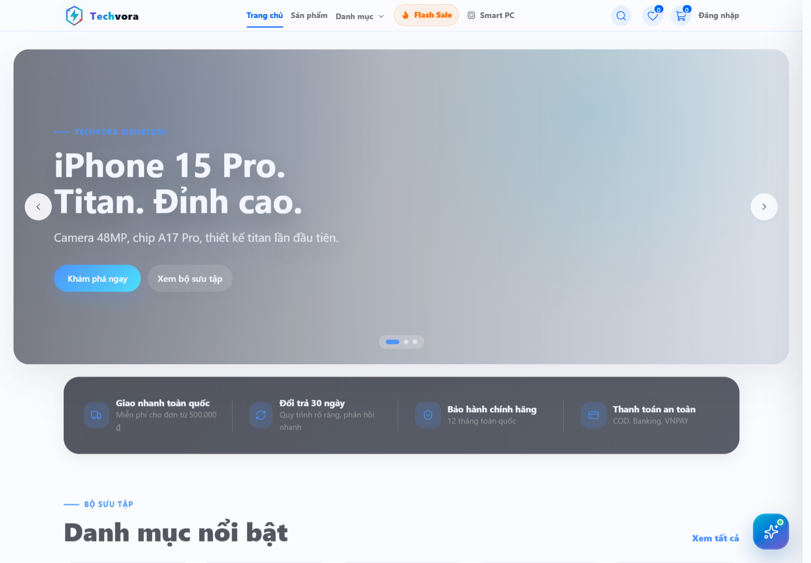

# Techvora — Cửa hàng điện thoại ASP.NET Core

Website bán điện thoại được xây dựng bằng **ASP.NET Core 8 MVC, EF Core, SQL Server và ASP.NET Core Identity**. Giao diện tiếng Việt, hỗ trợ desktop và mobile.



Ảnh demo khác: [trang quản trị](docs/screenshots/admin.png). [Chạy demo local](#demo-local) · [xem bằng chứng 82 test](evidence/backend-tests.md). Repo chưa có video hoặc URL triển khai công khai.

## Chức năng nổi bật

| Luồng | Chức năng |
| --- | --- |
| Mua sắm | Tìm kiếm, lọc/sắp xếp, phân trang, wishlist, so sánh và giỏ hàng |
| Đặt hàng | Checkout với địa chỉ giao hàng và thanh toán COD |
| Quản trị | Sản phẩm, danh mục, ảnh, thông số và banner |

Bản chạy mặc định chỉ bật **Sprint 1**. Mã nguồn Sprint 2–3 vẫn được giữ lại sau cổng phát hành để có thể khôi phục mà không cần chép lại file.

## Công nghệ

- ASP.NET Core 8 MVC và Razor Views
- Entity Framework Core 8, SQL Server và ASP.NET Core Identity
- HTML, CSS và JavaScript; asset dùng để chạy đã có sẵn trong `wwwroot`
- SMTP tùy chọn cho luồng đặt lại mật khẩu

## Demo local

Yêu cầu: **.NET SDK 8+** và **SQL Server** có quyền tạo database. Không cần cài Node.js hoặc Docker để chạy ứng dụng.

```powershell
git clone https://github.com/Anhtuan2005/E-Lectrical--Commerce-.git
cd E-Lectrical--Commerce-
dotnet restore EcommerceApp.sln
dotnet tool restore

# Có thể thay localhost bằng SQL Server instance trên máy của bạn.
dotnet user-secrets set "ConnectionStrings:DefaultConnection" "Server=localhost;Database=TechvoraDemo;Trusted_Connection=True;TrustServerCertificate=True;Encrypt=False"
dotnet tool run dotnet-ef database update

# Bật dữ liệu minh họa trên database demo riêng.
$env:Demo__Enabled = "true"
$env:Email__Enabled = "false"
dotnet run --project EcommerceApp.csproj --launch-profile http
```

Mở [http://localhost:5009](http://localhost:5009).

| Tài khoản demo | Mật khẩu | Quyền |
| --- | --- | --- |
| `admin@shop.vn` | `Admin@123` | Admin |
| `khachhang1@shop.vn` | `User@123` | Khách hàng |

`Demo:Enabled` mặc định là `false` và không được phép bật trong môi trường Production. Khi dùng xong, xóa biến demo bằng `Remove-Item Env:Demo__Enabled`.

Để xem luồng chính: đăng nhập tài khoản khách, chọn sản phẩm và đặt hàng COD; sau đó đăng nhập admin để xem đơn và tồn kho. Những tình huống khó tái hiện bằng giao diện như hai khách tranh món cuối hoặc callback thanh toán lặp được kiểm tra bằng [integration tests](tests/EcommerceApp.Tests/OrderPaymentTests.cs), không phải trong bản demo mặc định.

## Cấu trúc chính

```text
Controllers/     Điều hướng request, phân quyền và trả View/JSON
Data/            DbContext, migrations và dữ liệu demo
Models/          Entity và ViewModel
Services/        Nghiệp vụ và tích hợp dịch vụ ngoài
Views/           Giao diện Razor cho storefront và trang quản trị
wwwroot/         CSS, JavaScript và hình ảnh giao diện
```

Controller xử lý request và quyền truy cập; service giữ nghiệp vụ; EF Core ghi SQL Server. Checkout, tồn kho và voucher dùng transaction. Mã nguồn Sprint 2 xử lý callback VNPAY bằng cách kiểm tra chữ ký/số tiền rồi khóa và đọc lại trạng thái đơn để xử lý callback lặp.

## Kiểm thử

Project test nằm tại [`tests/EcommerceApp.Tests`](tests/EcommerceApp.Tests) và cần SQL Server để chạy integration tests. Mỗi lần chạy tạo database `TechvoraTests_*` riêng, migrate rồi xóa database đó sau test. Trên máy có SQL Server local với Windows Authentication:

```powershell
dotnet test tests/EcommerceApp.Tests/EcommerceApp.Tests.csproj
```

Nếu dùng SQL Server khác, đặt `TECHVORA_TEST_SQLSERVER` thành connection string của server test trước khi chạy. Lần kiểm tra local gần nhất: **82/82 test pass**; có test cho hai khách tranh món cuối, callback VNPAY lặp/đến sau hủy, hoàn kho đúng một lần, phân quyền admin và reset mật khẩu. [Lệnh, kết quả và mã test tiêu biểu](evidence/backend-tests.md) giúp kiểm chứng; [workflow CI](.github/workflows/portfolio-tests.yml) được cấu hình để chạy bộ test trên SQL Server 2022.

## Cấu hình tùy chọn

Dùng `dotnet user-secrets` khi phát triển và biến môi trường khi triển khai; trong tên biến môi trường, thay `:` bằng `__`.

| Cấu hình | Mục đích |
| --- | --- |
| `Release:ActiveSprint` | Sprint cao nhất được bật; mặc định `1` |
| `ConnectionStrings:DefaultConnection` | Kết nối SQL Server |
| `Demo:Enabled` | Tạo dữ liệu demo; mặc định `false` |
| `BootstrapAdmin:Email`, `BootstrapAdmin:Password` | Tạo tài khoản quản trị ban đầu |
| `Email:*` | Gửi email đặt lại mật khẩu |

Email được tắt khi chưa cung cấp thông tin xác thực, nên không bắt buộc để chạy bản demo cục bộ.

## Bật lại Sprint 2–3

Đặt `Release:ActiveSprint` thành `2` để bật Sprint 1 + 2, hoặc thành `3` để bật toàn bộ. Có thể dùng biến môi trường rồi khởi động lại ứng dụng:

```powershell
$env:Release__ActiveSprint = "2"
dotnet run --project EcommerceApp.csproj
```

Ở chế độ Sprint 1, route Sprint 2–3 trả `404`; menu và tiến trình nền tương ứng cũng không hoạt động. Build PC không thuộc backlog của đề tài điện thoại nên luôn bị khóa. Xác thực, phân quyền, chống CSRF và rate limit nền tảng vẫn được giữ để ứng dụng an toàn.
# TechvoraLab
